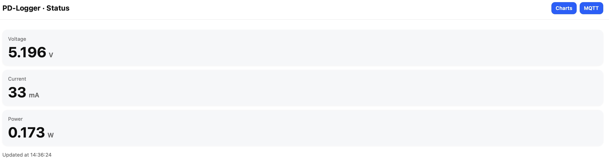
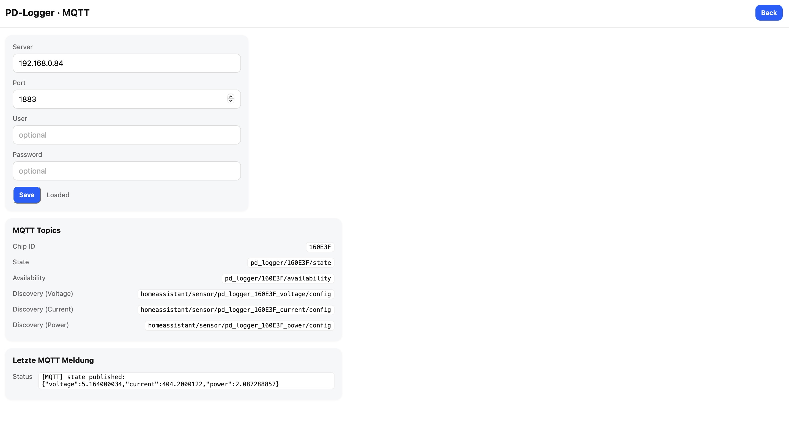

# USB-C Power Delivery Measurement Tools

This repository contains two DIY gadgets to monitor and log **USB-C Power Delivery (PD)**.  
Both devices are designed to be easy to build, hackable, and useful for makers who want to explore USB-C PD.

## Update 01.01.2026: MQTT implemented
I was asked by **@simonsayshomeassistant** whether PD Logger could be connected using MQTT. The answer was "no", but I really liked the idea and therefore implemented the MQTT feature today. 

I have added a MQTT button to the web interface:

It starts the MQTT configuration page, which looks like this:

Please note: I have tested MQTT with test.mosquitto.org and with a local mosquitto server. From what I see, **it all works fine.**
However, I have **not** tested with home assistant, simply because I do not have home assistant and know just little about it. 
Please provide feedback!

Best regards, Ludwin

---

## ✨ Features

- **DIY Power Meter**  
  Small device with an OLED display showing **voltage, current, and power** in real time.  
  Powered by an STM32 microcontroller.

- **PD Logger**  
  Wi-Fi enabled device based on ESP-01s.  
  Logs **voltage, current, and power** for several hours and serves interactive plots in any web browser.

---

## 📷 Devices

### Power Meter

### PD Logger

---

## 🛠️ How it works

- **USB-C connectors**: male on the input side, female on the output side.  
- **CC & VCONN lines** are passed through to handle PD voltage negotiation.  
- **Shunt resistor (50 mΩ)** allows precise current measurement.  
- **INA219 sensor** measures voltage and current via I²C.  
- **Step-down converter** generates 3.3 V from 5–20 V input.  
- **MCUs**: STM32 with OLED display (Power Meter), ESP-01s with Wi-Fi (PD Logger).  

---

## 📦 Hardware

- **Schematics & PCB files** → in this repo (`/electronics`)  
- **PCBs manufactured by** [JLCPCB](https://jlcpcb.com)  
- **3D printable cases** → in `/mechanics`  
- **Firmware** → in `/software`

All production data is included in `/electronics` so you can **order, print, and build your own devices**.

---

## 🌐 Usage

- **Power Meter**: plug between charger and device → read values on the display.  
- **PD Logger**: connect to your local Wi-Fi, then open `http://pd-logger.local` → see live values.  
  - Update interval: 5 seconds  
  - Logging capacity: several hours  
  - Data download as CSV file  
  - Interactive plots for Voltage / Current / Power over time  

---

## 📄 License

This project is licensed under the  
**Creative Commons Attribution-NonCommercial-ShareAlike 4.0 International (CC BY-NC-SA 4.0)** license.  

You are free to **share and adapt** the material, **for non-commercial purposes only**,  
as long as you provide proper attribution and distribute your contributions under the same license.  

For details, see the [LICENSE](LICENSE) file.  

---

## 🙌 Acknowledgments

- [Hackaday CH224K USB PD Decoy project](https://hackaday.io/) for inspiration  
